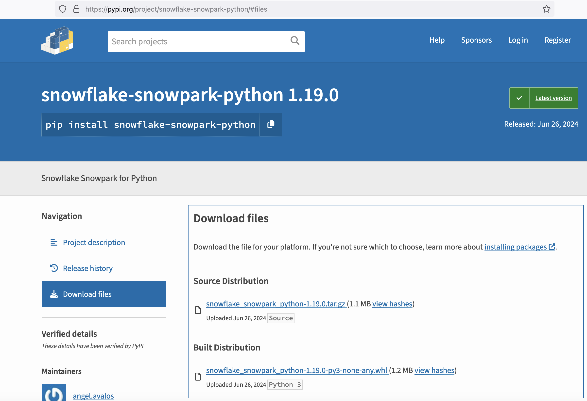
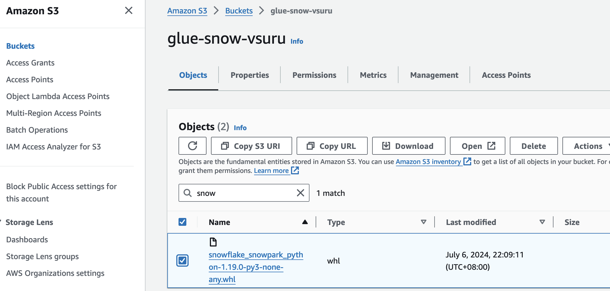
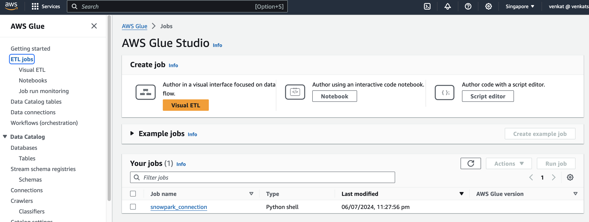
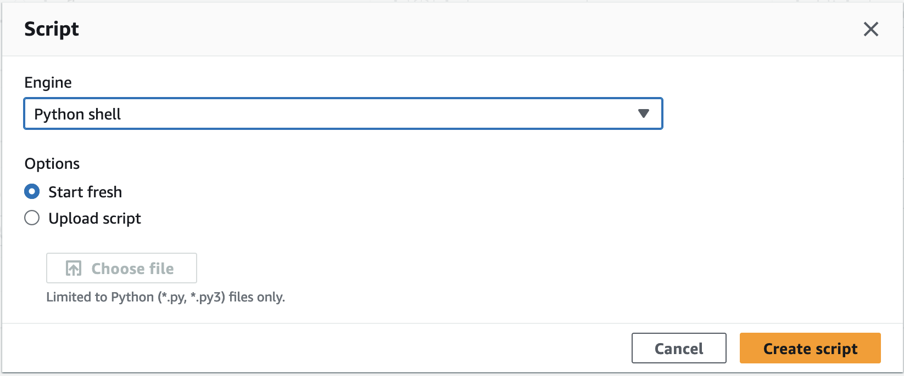
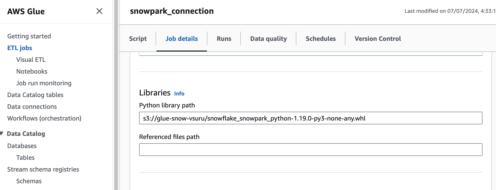
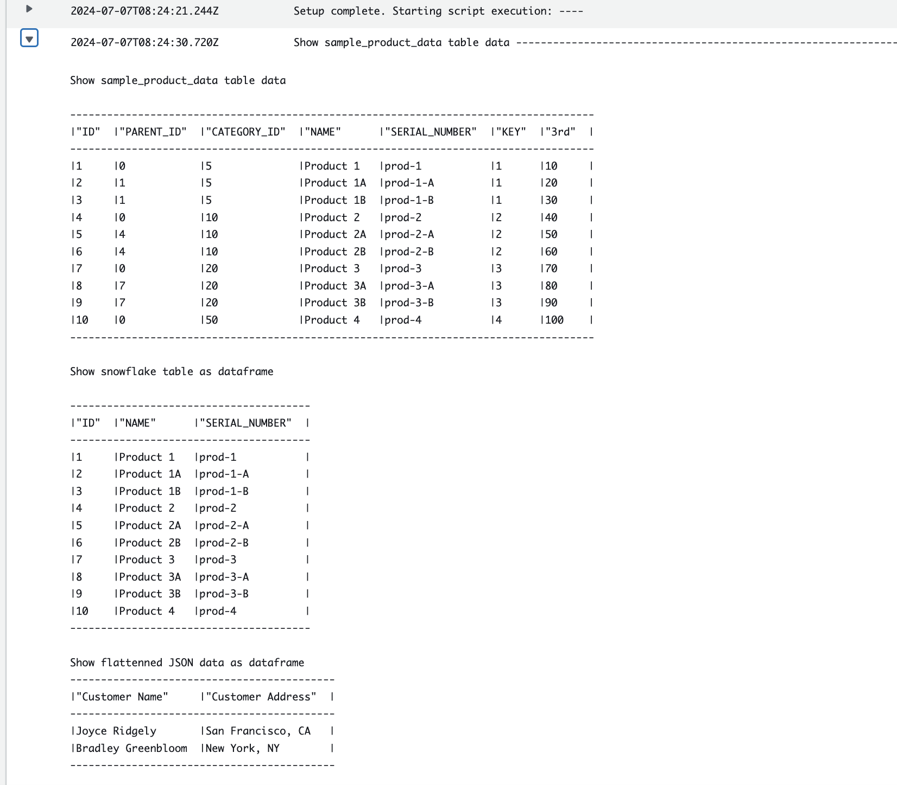

# AWS GLUE & SNOWPARK Integration - Working with Dataframes

### Prerequisites

1. **Snowflake credentials setup in AWS Secrets**
  If you have already created a secret for Snowflake connection, you can use the same secret.

2. **Permissions to work in Glue, S3 (IAM Role with policy)**
  If you are using the default `AWSGlueServiceRole-glueworkshop`, the necessary permissions should already be provided.

   > AmazonS3FullAccess
   > AWSGlueConsoleFullAccess
   > AWSGlueServiceRole
   > SecretsManagerReadWrite

### Step by Step instruction to setup Snowpark in AWS Glue

1. **Login to Snowflake account, open SQL Worksheet, copy and paste the below code. Hit the Run button.**
   **Below creates a table and stores semi-structured data. Later on we would be reading this JSON data in AWS Glue using Snowpark** **Dataframe API**

```sql
CREATE DATABASE SNOWPARK_DEMO;

CREATE OR REPLACE TABLE car_sales
(
  src variant
)
AS
SELECT PARSE_JSON(column1) AS src
FROM VALUES
('{
    "date" : "2017-04-28",
    "dealership" : "Valley View Auto Sales",
    "salesperson" : {
      "id": "55",
      "name": "Frank Beasley"
    },
    "customer" : [
      {"name": "Joyce Ridgely", "phone": "16504378889", "address": "San Francisco, CA"}
    ],
    "vehicle" : [
      {"make": "Honda", "model": "Civic", "year": "2017", "price": "20275", "extras":["ext warranty", "paint protection"]}
    ]
}'),
('{
    "date" : "2017-04-28",
    "dealership" : "Tindel Toyota",
    "salesperson" : {
      "id": "274",
      "name": "Greg Northrup"
    },
    "customer" : [
      {"name": "Bradley Greenbloom", "phone": "12127593751", "address": "New York, NY"}
    ],
    "vehicle" : [
      {"make": "Toyota", "model": "Camry", "year": "2017", "price": "23500", "extras":["ext warranty", "rust proofing", "fabric protection"]}
    ]
}') v;

-- Grant minimum required permissions to the role
GRANT USAGE ON DATABASE SNOWPARK_DEMO TO ROLE glue_de_role;
GRANT USAGE ON SCHEMA SNOWPARK_DEMO.PUBLIC TO ROLE glue_de_role;
GRANT CREATE TABLE ON SCHEMA SNOWPARK_DEMO.PUBLIC TO ROLE glue_de_role;
GRANT SELECT ON TABLE PUBLIC.CAR_SALES TO ROLE glue_de_role;

SELECT * FROM car_sales;

SELECT src:dealership, src:salesperson.name, src:vehicle[0].make
    FROM car_sales
    ORDER BY 1;
```

2. **Download Snowpark from the below link.**

   [Snowpark Download Link](https://pypi.org/project/snowflake-snowpark-python/)

   Click on distribution and download the .whl file

   

3. **Use the existing `glueworkshop` S3 bucket, upload the .whl file and copy the S3 URI.**

   

4. **In AWS Glue click under ETL jobs, click on Script Editor.**

   

   **Under Engine options choose Python Shell.**

   

   **Under Job details, enter job name and in Advanced properties, Python Library path paste the S3 File URI copied in step 1.**

   

5. **Click on the Script Tab, copy and paste the below code. Replace the value of connection_parameters['account'] with your Snowflake account URL. Click Save and Run the job.**

```python
import os
import json
import snowflake.snowpark.functions
from snowflake.snowpark import Session
from snowflake.snowpark.types import *
from snowflake.snowpark.functions import col
import boto3

client = boto3.client("secretsmanager")
secret_response = client.get_secret_value(SecretId='glue-snowflake-secret')
snowflake_details = json.loads(secret_response['SecretString'])

connection_parameters = {
    "account": "<account url in the format of XXXXXXX.AWS_REGION>",
    "user": snowflake_details['sfUser'],
    "password": snowflake_details['sfPassword'],
    "role": "glue_de_role",  # optional
    "warehouse": snowflake_details['sfWarehouse'],  # optional
    "database": "SNOWPARK_DEMO",  # optional
    "schema": "PUBLIC",  # optional
}

session = Session.builder.configs(connection_parameters).create()
# SQL
session.sql("use database snowpark_demo").collect()
session.sql("use schema snowpark_demo.public").collect()
session.sql('CREATE OR REPLACE TABLE sample_product_data (id INT, parent_id INT, category_id INT, name VARCHAR, serial_number VARCHAR, key INT, "3rd" INT)').collect()
session.sql("""
    INSERT INTO sample_product_data VALUES
    (1, 0, 5, 'Product 1', 'prod-1', 1, 10),
    (2, 1, 5, 'Product 1A', 'prod-1-A', 1, 20),
    (3, 1, 5, 'Product 1B', 'prod-1-B', 1, 30),
    (4, 0, 10, 'Product 2', 'prod-2', 2, 40),
    (5, 4, 10, 'Product 2A', 'prod-2-A', 2, 50),
    (6, 4, 10, 'Product 2B', 'prod-2-B', 2, 60),
    (7, 0, 20, 'Product 3', 'prod-3', 3, 70),
    (8, 7, 20, 'Product 3A', 'prod-3-A', 3, 80),
    (9, 7, 20, 'Product 3B', 'prod-3-B', 3, 90),
    (10, 0, 50, 'Product 4', 'prod-4', 4, 100),
    (11, 10, 50, 'Product 4A', 'prod-4-A', 4, 100),
    (12, 10, 50, 'Product 4B', 'prod-4-B', 4, 100)
    """).collect()

print("Show sample_product_data table data\n")
session.sql("select * from sample_product_data").show()

# Read Snowflake table as Dataframe
product_df = session.table("sample_product_data").select(col("id"), col("name"), col("serial_number"))
print("Show snowflake table as dataframe\n")
product_df.show()

# Create dataframe and write to Snowflake Table
customer_df = session.create_dataframe([[1, 2, 3, 4]], schema=["a", "b", "c", "d"])
customer_df.write.mode('overwrite').save_as_table("sample_customer_data")

# Read semi-structured data from Snowflake Variant data type and transverse JSON data using dataframe
car_sales_df = session.table("car_sales")
print("Show flattenned JSON data as dataframe")
car_sales_df.join_table_function("flatten", col("src")["customer"]).select(col("value")["name"].cast(StringType()).as_("Customer Name"), col("value")["address"].cast(StringType()).as_("Customer Address")).show()

session.close()
```

6. **Once the job is running, click on Runs tab to monitor the status for erros.**
   **Under Run Detials, Click on Output Logs and click on the cloud watch log group:**
   **On Successfull run the last line for the log should display data frame and flatten outputs shown below**

   

### This Concludes setup and working using Snowpark in AWS Glue
