# AWS Glue-Snowflake Integration Workshop

This repository contains step-by-step guide on how to set-up AWS Glue connector for Snowflake and a sample ETL job that uses this connector.

## Table of contents
1. [Pre-requisites](#pre-requisites)
1. [Snowflake Set-up](#snowflake-set-up)
1. [AWS Set-up](#aws-set-up)
1. [Validate the ETL job completion](#validate-the-etl-job-completion)

## Pre-requisites

Complete Lab 01: Working with Glue Data Catalog > Using AWS Console from [Glue Immersion Day workshop](https://catalog.us-east-1.prod.workshops.aws/workshops/ee59d21b-4cb8-4b3d-a629-24537cf37bb5/en-US). This lab assumes that the Glue table `console_csv` in Glue database `console_glueworkshop` are present in your AWS account.

## Snowflake Set-up

In a new browser tab, go to http://signup.snowflake.com/ and sign-up for a new account. Ensure that you choose **Enterprise** for the "Choose your Snowflake edition" question and **AWS** for the "Choose your cloud provider" question.

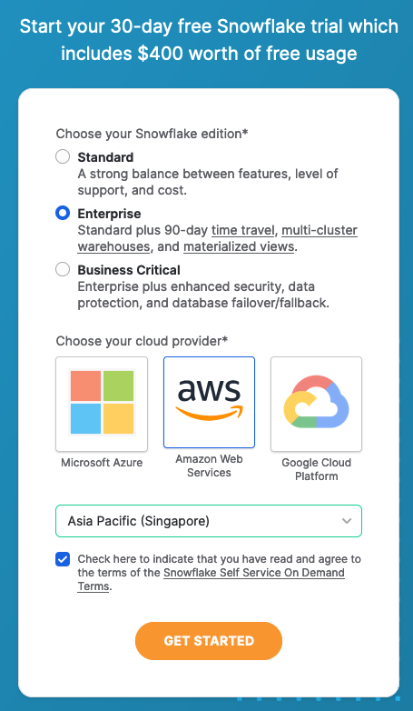

After registering, you will receive an email with an activation link and your Snowflake Account URL. Open a browser window, enter the URL of your Snowflake Account and sign in to the account.

Follow the below steps to complete the setup:
1. Click on the Projects Tab in the left-hand navigation bar and click Worksheets. Within Worksheets, click the "+" button in the   top-right corner of Snowsight.
1. Rename the Worksheet by clicking on the auto-generated Timestamp name and inputting "Glue-Snowflake Lab Setup"
1. Copy the SQL code in [snowflake-setup.sql](./snowflake-setup.sql) and paste it in the `Glue-Snowflake Lab Setup` Worksheet. In the worksheet, next to "► Run" Click "▼" and choose "Run All". These SQL commands will 1/ create a Snowflake user, 2/ create a virtual warehouse, 3/ create a role to be used by the user, 4/ create a view, and 5/ grant the necessary permissions.
1. In the bottom left corner of the Snowsight UI, click on your name and hover your cursor on `Account`, followed by the account number, and click on the link button to copy your account URL. Keep this value which will be used in the following AWS Glue setup step.

    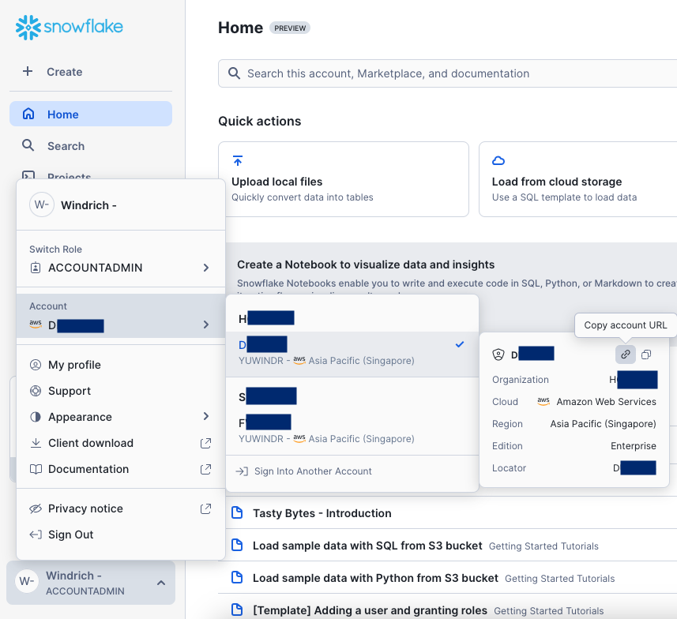

## AWS Set-up

### Create a secret in AWS Secrets Manager

1. In your AWS console, go to AWS Secrets Manager. Then, click **Store a new secret**.
1. Step 1: Choose secret type - choose **Other type of secret**. Input the following key/value pairs and click **Next**.
    * Key: `sfUser` | Value: `glue_de_user`
    * Key: `sfPassword` | Value: `GlueSFDemo123`
    * Key: `sfWarehouse` | Value: `glue_de_wh` (Note: The User’s default Virtual Warehouse will be used if this value is not set.)

    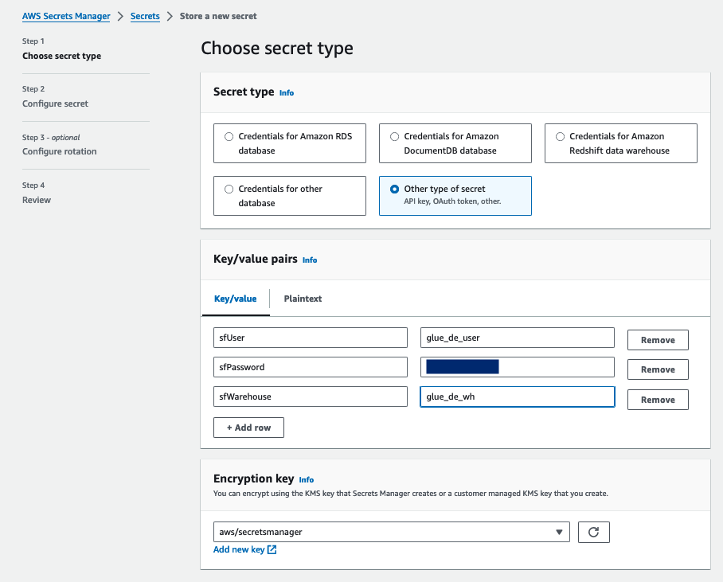

1. Step 2: Configure secret - input `glue-snowflake-secret` for the secret name. Leave the rest as default, click **Next** until Step 4: Review, and click **Store**

    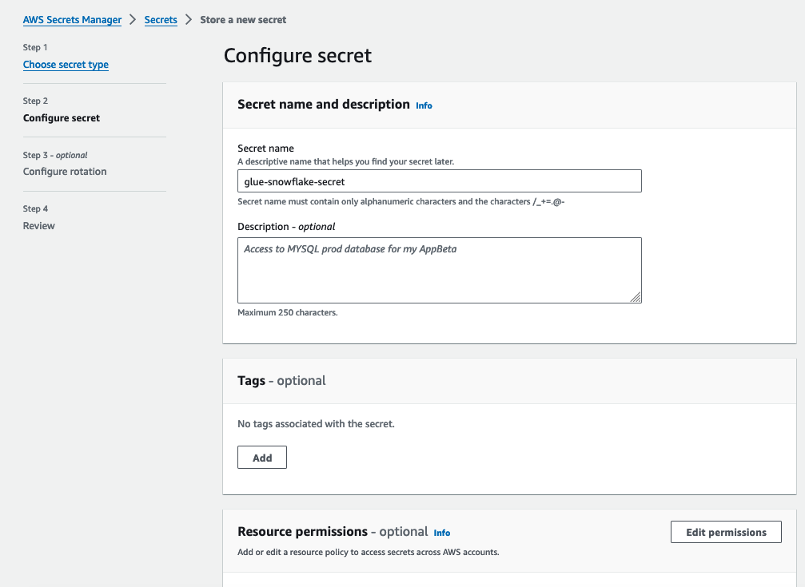

### Grant Glue service role permissions to the Secret

1. In your AWS console, go to AWS IAM and click on **Roles** from the left navbar. Search for `AWSGlueServiceRole-glueworkshop` and click into it.
1. Click **Add permissions** dropdown, and choose **Attach policies**. Search for `SecretsManagerReadWrite` and attach the policy to the role by clicking **Add permissions**. This will allow the Glue service role permission to retrieve the secret values you created in the previous step.
    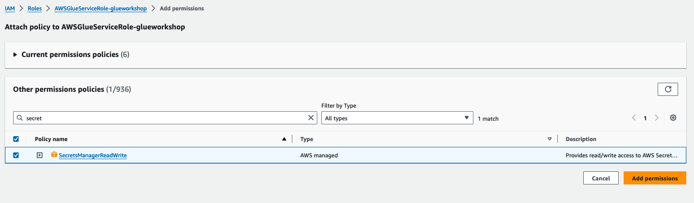

### Create AWS Glue connector for Snowflake

1. In your AWS console, go to AWS Glue. Click on **Data Connections** on the left navbar, then click **Create connection**.
1. Step 1: Choose data source - search and choose **Snowflake**. Under **Configure connection**, input the Snowflake URL you copied in the previous step, and choose the secret created.
    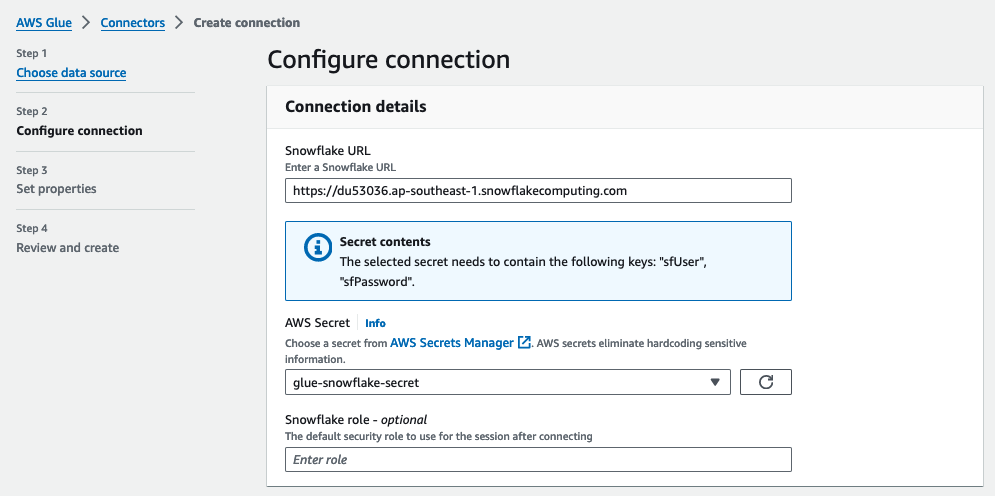
1. Expand the **Network options - optional**. Here you need to specify the VPC configurations. To get the required values, search for `VPC` in the top search bar of AWS console and open it in a new browser tab.
1. Go to VPCs, and take note of the VPC ID with the name `glueworkshop`.
    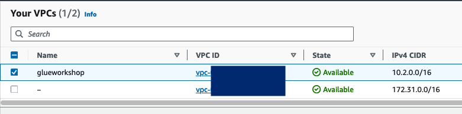
1. Go to Subnets in the left navbar, filter by the `glueworkshop` VPC and take note of the Subnet ID with the name `MWAAEnvironment Private Subnet (AZ1)`.
    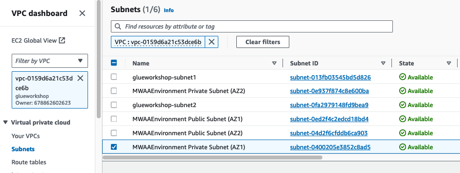
1. Go back to the Glue create connector console, and choose the VPC ID and subnet ID that you took note of above. For security groups, you can choose the security group that starts with `glueimmersionday-workshopstudio-v1-DefaultVPCSecurityGroup`. Then, click **Next**.
    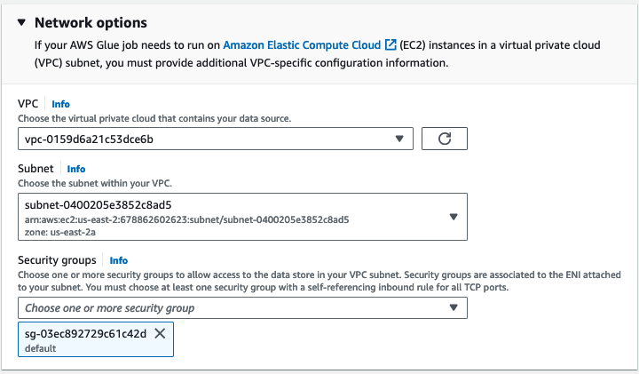
1. Leave `Snowflake connection` as the name, and click **Next** and then **Create connection**.


### Create an AWS Glue ETL job using Glue Studio

1. From the Glue console, go to ETL jobs > Visual ETL in the left navbar. Click **Visual ETL** under the "Create job" section.
1. The Glue Studio window will appear. Go to **Job details** tab, and fill in the following parameters:
    - Name: `glue-snowflake-etl`
    - IAM Role: choose the pre-created IAM role (it should be named `AWSGlueServiceRole-glueworkshop`)
    
    Leave the rest as default.
    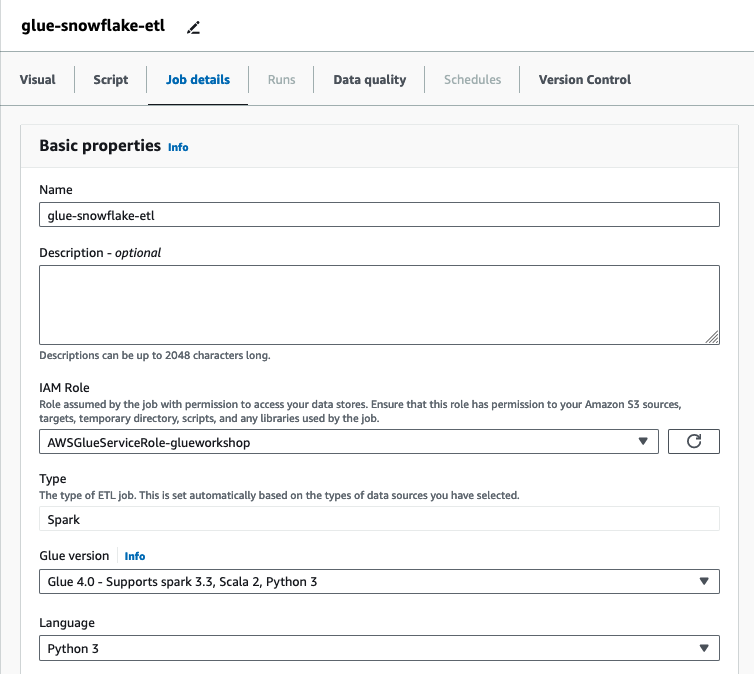

1. Go back to the **Visual** tab, and click the **+** button. For the first node, Choose `AWS Glue Data Catalog` and click on the node. Choose `console_glueworkshop` for the Database, `console_csv` for the Table.
    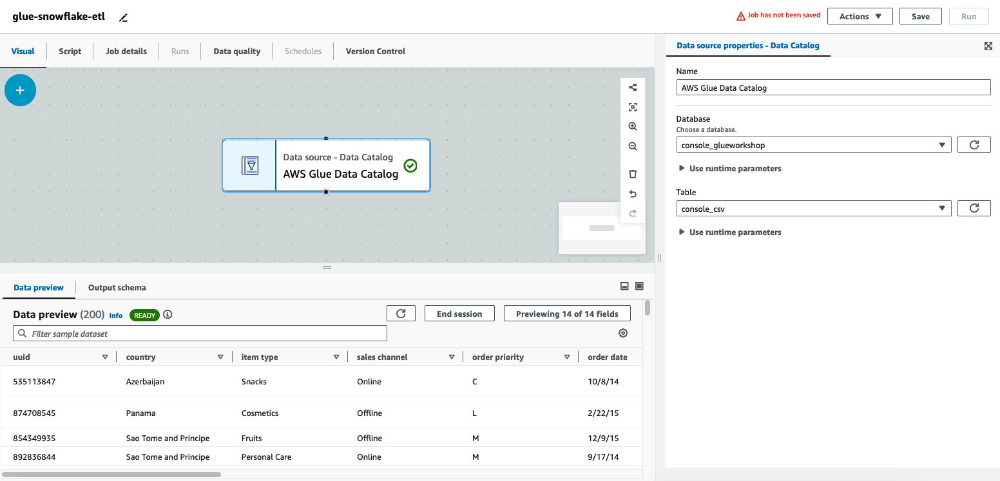

1. Click the **+** button to create another node. Under **Transforms** choose `Drop Fields`. Choose the columns `unit cost`, `total cost` and `total profit` to drop. This is to simulate the case where you would want to remove the profit-related values which may be sensitive.
    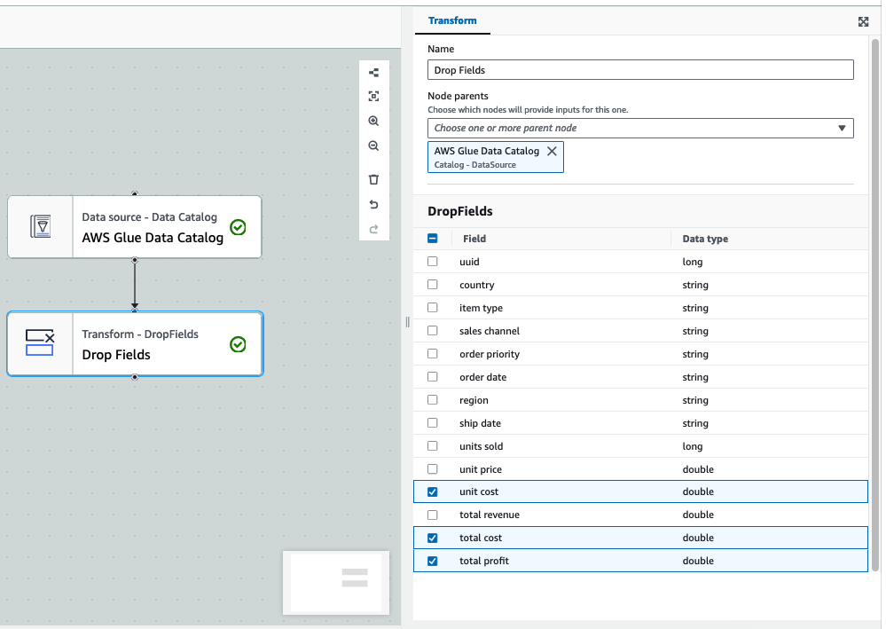

1. Click the **+** button to create another node. Under **Transforms** choose `Evaluate Data Quality`. In the **Ruleset editor**, paste the following ruleset.
    ```
        Rules = [
            IsUnique "UUID",
            ColumnValues "sales channel" in ["Offline", "Online"],
            ColumnValues "order priority" in ["L", "M", "H", "C"],
            CustomSql "SELECT COUNT(*) FROM primary WHERE `total revenue` != ROUND(`units sold` * `unit price`, 2)" = 0
        ]
    ```

1. Under **Data quality transform output**, check `Original data`. Under **Data quality actions**, choose `Fail job without loading target data`. 
    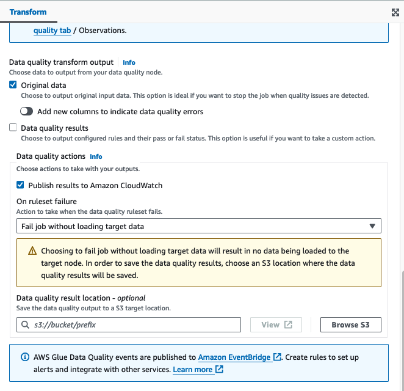

1. You should see a new node called `originalData` being added in the visual graph. Click on that node, and then click the **+** button to create another node. Under **Targets** choose `Snowflake`. Choose the Snowflake connection you created previously `Snowflake connection`, and fill in `glue_db` for database, `glue_workshop` for schema, and `orders` for table.
    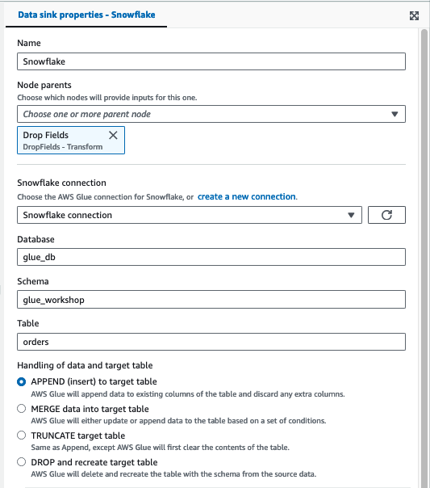

1. Click **Save** and then click **Run**.

## Validate the ETL job completion

1. In the Glue visual ETL console, go to **Runs** tab and ensure that the job has successfully completed.
    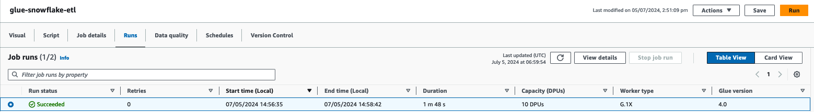

1. Navigate to **Data quality** tab to see the data quality results from the ETL job. You can optionally download the DQ results.
    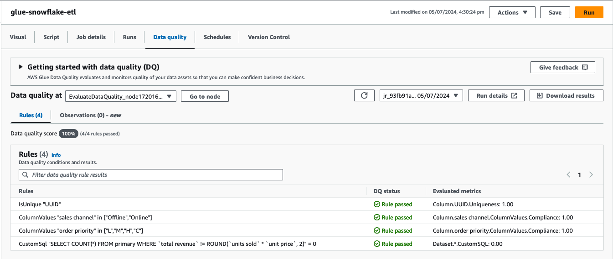

1. Navigate back to Snowflake Snowsight UI. In the same worksheet, or in a new worksheet, run the following SQL commands to validate that a new table `orders` is created in the `glue_db.glue_workshop` schema, with the profit-related columns dropped.

    ```sql
    SELECT * from glue_workshop.orders LIMIT 50;
    SELECT COUNT(*) from glue_workshop.orders;
    ```

Congratulations! You have successfully created AWS Glue native Snowflake connector and used it to do a simple ETL job to load data into Snowflake.