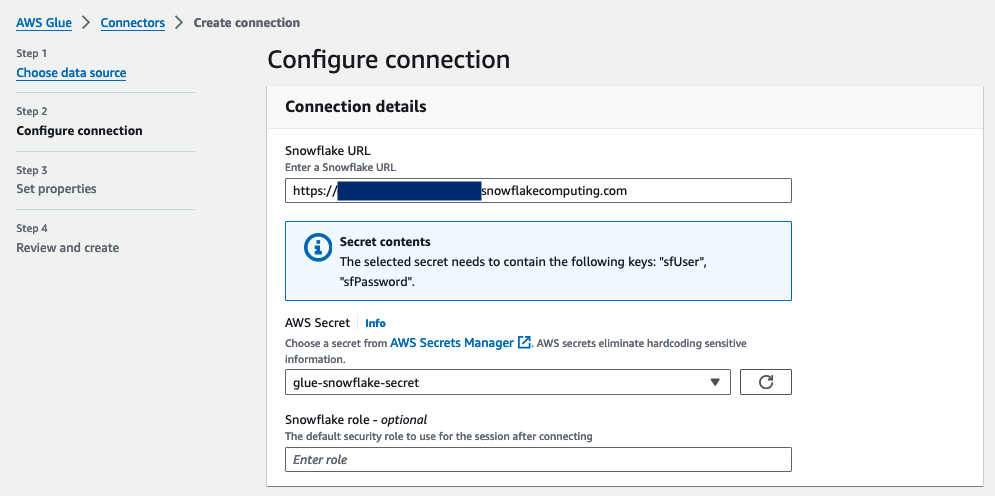
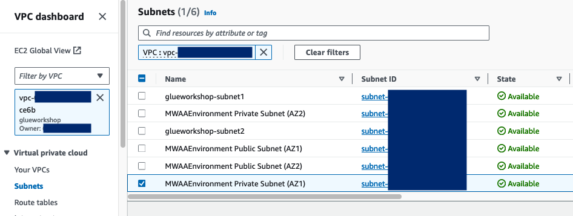
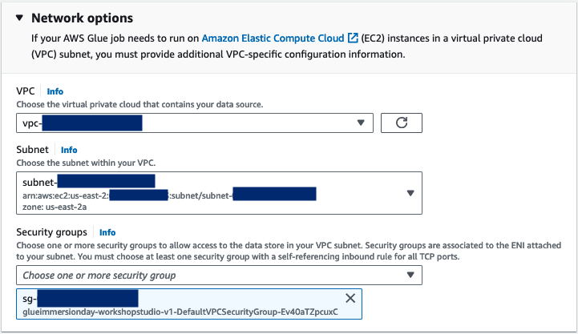

# AWS Glue-Snowflake Integration Workshop

This repository contains step-by-step guide on how to set-up AWS Glue connector for Snowflake and a sample ETL job that uses this connector.

## Pre-requisites:

Complete Lab 01: Working with Glue Data Catalog > Using AWS Console from Glue Immersion Day workshop. This lab assumes that the Glue table `console_csv` in Glue database `console_glueworkshop` are present in your AWS account.

## Snowflake Set-up

In a new browser tab, go to http://signup.snowflake.com/ and sign-up for a new account. Ensure that you choose **Enterprise** for the "Choose your Snowflake edition" question and **AWS** for the "Choose your cloud provider" question.

    

After registering, you will receive an email with an activation link and your Snowflake Account URL. Open a browser window, enter the URL of your Snowflake Account and sign in to the account.

Follow the below steps to complete the setup:
1. Click on the Projects Tab in the left-hand navigation bar and click Worksheets. Within Worksheets, click the "+" button in the   top-right corner of Snowsight.
1. Rename the Worksheet by clicking on the auto-generated Timestamp name and inputting "Glue-Snowflake Lab Setup"
1. Copy the SQL code in [snowflake-setup.sql](./snowflake-setup.sql) and paste it in the `Glue-Snowflake Lab Setup` Worksheet. In the worksheet, next to "► Run" Click "▼" and choose "Run All". These SQL commands will 1/ create a Snowflake user, 2/ create a virtual warehouse, 3/ create a role to be used by the user, 4/ create a view, and 5/ grant the necessary permissions.
1. In the bottom left corner of the Snowsight UI, click on your name and hover your cursor on `Account`, followed by the account number, and click on the link button to copy your account URL. Keep this value which will be used in the following AWS Glue setup step.

    

## AWS Glue Set-up

### Create a secret in AWS Secrets Manager

1. In your AWS console, go to AWS Secrets Manager. Then, click **Store a new secret**.
1. Step 1: Choose secret type - choose **Other type of secret**. Input the following key/value pairs and click **Next**.
    * Key: `sfUser` | Value: `glue_de_user`
    * Key: `sfPassword` | Value: `GlueSFDemo123`
    * Key: `sfWarehouse` | Value: `glue_de_wh` (Note: The User’s default Virtual Warehouse will be used if this value is not set.)

    

1. Step 2: Configure secret - input `glue-snowflake-secret` for the secret name. Leave the rest as default, click **Next** until Step 4: Review, and click **Store**

    

### Create AWS Glue connector for Snowflake

1. In your AWS console, go to AWS Glue. Click on **Data Connections** on the left navbar, then click **Create connection**.
1. Step 1: Choose data source - search and choose **Snowflake**. Under **Configure connection**, input the Snowflake URL you copied in the previous step, and choose the secret created.
    
1. Expand the **Network options - optional**. Here you need to specify the VPC configurations. To get the required values, search for `VPC` in the top search bar of AWS console and open it in a new browser tab.
1. Go to VPCs, and take note of the VPC ID with the name `glueworkshop`.
    
1. Go to Subnets in the left navbar, filter by the `glueworkshop` VPC and take note of the Subnet ID with the name `MWAAEnvironment Private Subnet (AZ1)`.
    
1. Go back to the Glue create connector console, and choose the VPC ID and subnet ID that you took note of above. For security groups, you can choose the `default` security group. Then, click **Next**.
    
1. Leave `Snowflake connection` as the name, and click **Next** and then **Create connection**.
